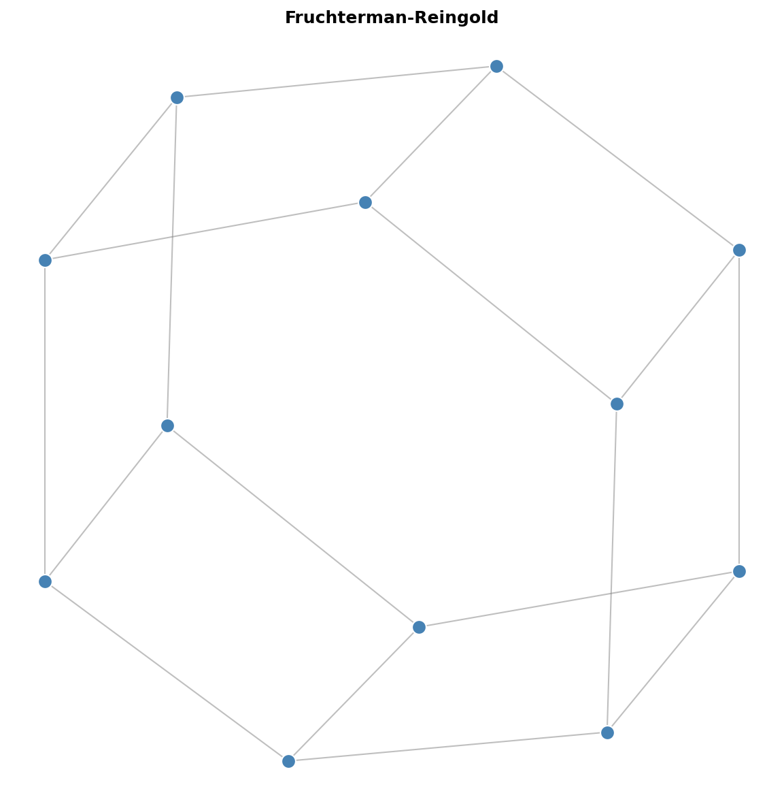
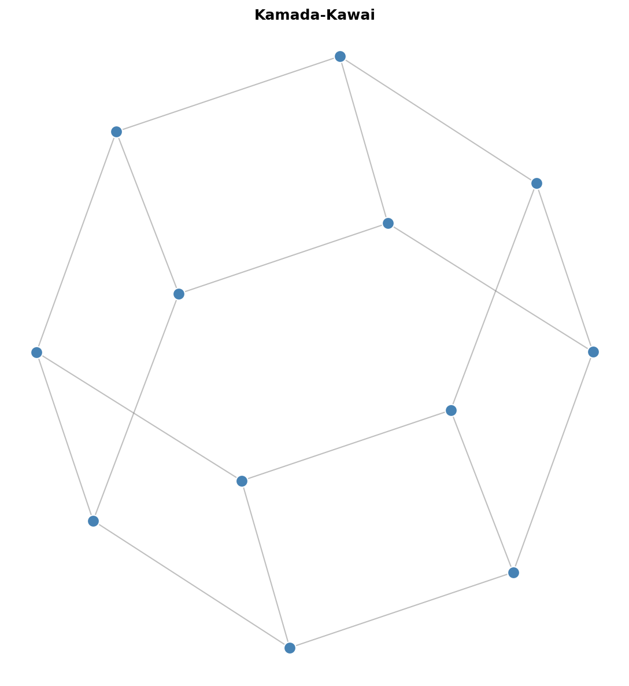
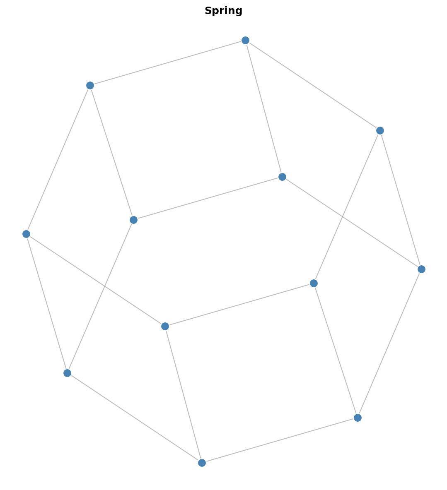
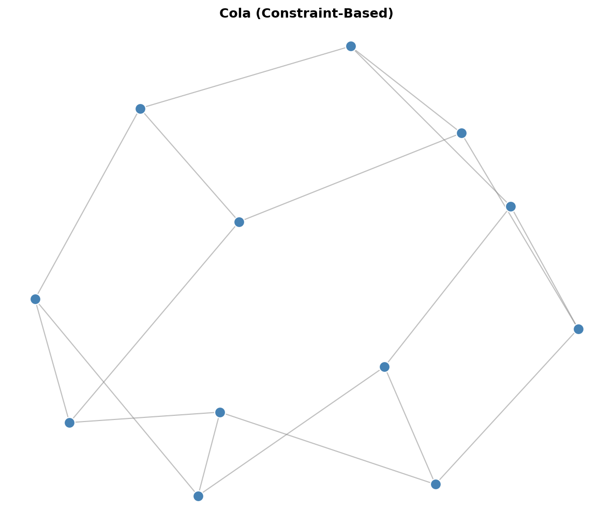
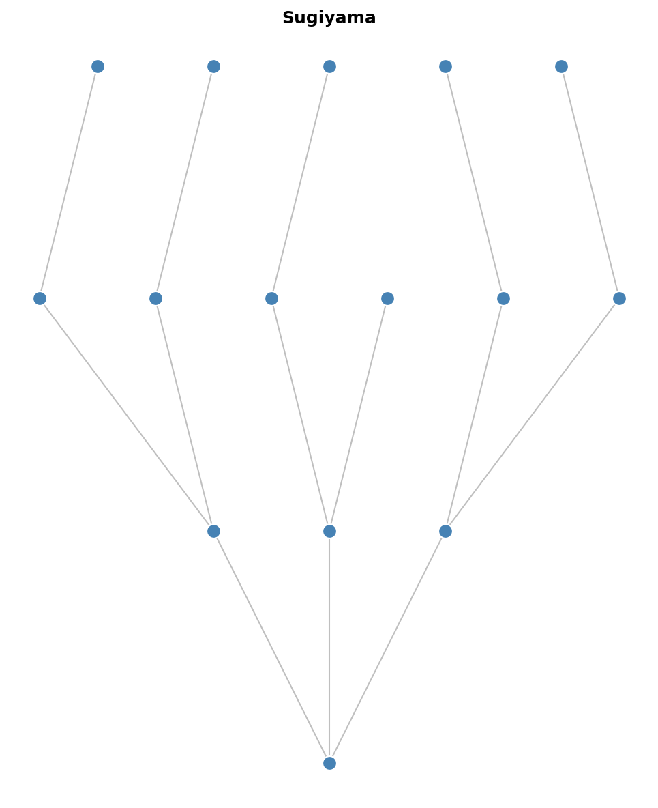
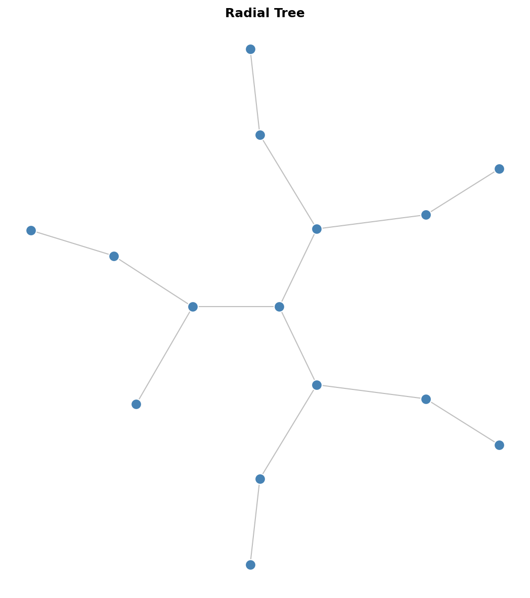
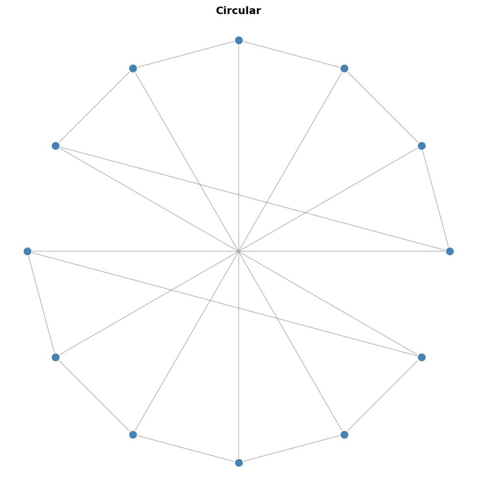
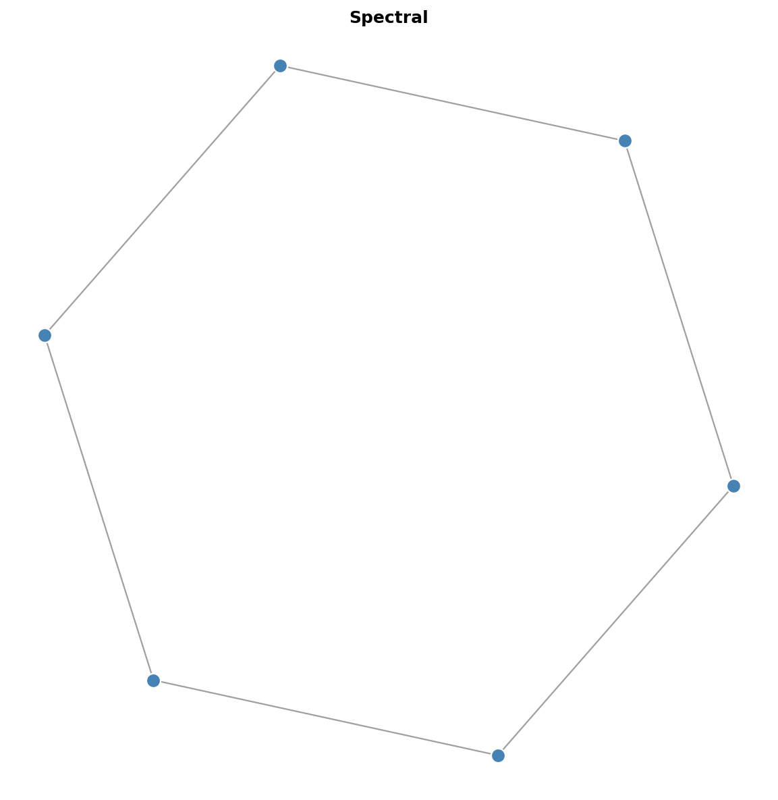

# Graph Layout Algorithms Guide

This guide explains the different graph layout algorithms available in `graph-layout`, their characteristics, and when to use each one.

## Algorithm Families

| Family | Algorithms | Approach |
|--------|-----------|----------|
| **Force-Directed** | Fruchterman-Reingold, Kamada-Kawai, Spring | Simulate physical forces between nodes |
| **Constraint-Based** | Cola | Optimize with constraints and overlap avoidance |
| **Hierarchical** | Sugiyama, Reingold-Tilford, Radial Tree | Layer-based or tree-structured layouts |
| **Circular** | Circular, Shell | Arrange nodes on circles |
| **Spectral** | Spectral | Use graph eigenvalues for positioning |

---

## Force-Directed Layouts

Force-directed algorithms simulate a physical system where nodes repel each other (like charged particles) and edges act as springs pulling connected nodes together. The layout converges when forces reach equilibrium.

### Fruchterman-Reingold

**Best for:** General-purpose graph visualization with aesthetic results.



```python
from graph_layout import FruchtermanReingoldLayout

layout = FruchtermanReingoldLayout(
    nodes=nodes,
    links=links,
    size=(800, 600),
    iterations=300,
    temperature=None,      # Auto-calculated if None
    cooling_factor=0.95,   # Temperature decay per iteration
)
layout.run()
```

**Characteristics:**

- Uses temperature/cooling schedule for simulated annealing
- Repulsive force: `k^2 / d` (inverse of distance)
- Attractive force: `d^2 / k` (quadratic with distance)
- Cython-accelerated for high performance

**Complexity:** O(n^2) per iteration (or O(n log n) with Barnes-Hut)

**Parameters:**

| Parameter | Description | Default |
|-----------|-------------|---------|
| `iterations` | Number of simulation steps | 300 |
| `temperature` | Initial max displacement | Auto |
| `cooling_factor` | Temperature multiplier per step | 0.95 |
| `use_barnes_hut` | Enable O(n log n) approximation | False |
| `barnes_hut_theta` | Accuracy vs speed (0=exact, 1=fast) | 0.5 |

**When to use Barnes-Hut:**

- Graphs with 2000+ nodes
- When approximate positions are acceptable
- Real-time or interactive applications

---

### Kamada-Kawai

**Best for:** Small to medium graphs where edge lengths should reflect graph-theoretic distances.



```python
from graph_layout import KamadaKawaiLayout

layout = KamadaKawaiLayout(
    nodes=nodes,
    links=links,
    size=(800, 600),
    iterations=100,
)
layout.run()
```

**Characteristics:**

- Minimizes stress: deviation between geometric and graph-theoretic distances
- Computes all-pairs shortest paths (expensive for large graphs)
- Produces layouts where edge length correlates with path length
- Good for revealing graph structure

**Complexity:** O(n^3) for shortest paths + O(n^2) per iteration

**Parameters:**

| Parameter | Description | Default |
|-----------|-------------|---------|
| `iterations` | Number of optimization steps | 100 |
| `epsilon` | Convergence threshold | 1e-4 |

**Trade-offs:**

- Higher quality than Fruchterman-Reingold for small graphs
- Much slower for large graphs due to all-pairs shortest paths
- Best limited to graphs under ~200 nodes

---

### Spring Layout

**Best for:** Simple layouts, educational purposes, or as a baseline.



```python
from graph_layout import SpringLayout

layout = SpringLayout(
    nodes=nodes,
    links=links,
    size=(800, 600),
    iterations=100,
    spring_length=100,   # Ideal edge length
    spring_strength=0.1, # Spring constant
    repulsion=1000,      # Repulsion strength
)
layout.run()
```

**Characteristics:**

- Simple Hooke's law springs for edges
- Coulomb-like repulsion between all node pairs
- No cooling schedule (constant forces)
- Easy to understand and modify

**Complexity:** O(n^2) per iteration

**Parameters:**

| Parameter | Description | Default |
|-----------|-------------|---------|
| `iterations` | Number of simulation steps | 100 |
| `spring_length` | Ideal edge length | 100 |
| `spring_strength` | Edge spring constant | 0.1 |
| `repulsion` | Node repulsion strength | 1000 |
| `damping` | Velocity damping factor | 0.5 |

---

## Constraint-Based Layout (Cola)

### ColaLayoutAdapter

**Best for:** Layouts requiring constraints, overlap avoidance, or hierarchical grouping.



```python
from graph_layout import ColaLayoutAdapter

layout = ColaLayoutAdapter(
    nodes=nodes,
    links=links,
    avoid_overlaps=True,
    link_distance=100,
    iterations=50,
)
layout.run()
```

**Characteristics:**

- Port of WebCola constraint-based layout
- VPSC solver for separation constraints
- Supports node overlap avoidance
- Hierarchical group containment
- Flow layouts (directional bias)

**Complexity:** O(n^2) per iteration + constraint solving overhead

**Parameters:**

| Parameter | Description | Default |
|-----------|-------------|---------|
| `iterations` | Layout iterations | 50 |
| `link_distance` | Ideal edge length (number or function) | 100 |
| `avoid_overlaps` | Prevent node overlap | False |
| `handle_disconnected` | Layout disconnected components | True |
| `convergence_threshold` | Stop when stress change below this | 1e-4 |

**Advanced Features:**

```python
# Separation constraints
from graph_layout.cola.linklengths import SeparationConstraint

constraint = SeparationConstraint(axis='x', left=0, right=1, gap=50)
layout = ColaLayoutAdapter(
    nodes=nodes,
    links=links,
    constraints=[constraint],
)

# Hierarchical groups
groups = [
    {'leaves': [0, 1, 2], 'padding': 10},
    {'leaves': [3, 4], 'padding': 10},
]
layout = ColaLayoutAdapter(
    nodes=nodes,
    links=links,
    groups=groups,
)

# Flow layout (left-to-right)
layout = ColaLayoutAdapter(
    nodes=nodes,
    links=links,
    flow_direction='x',  # or 'y' for top-to-bottom
)
```

---

## Hierarchical Layouts

### Sugiyama Layout

**Best for:** Directed acyclic graphs (DAGs), flowcharts, dependency graphs.



```python
from graph_layout import SugiyamaLayout

layout = SugiyamaLayout(
    nodes=nodes,
    links=links,
    size=(800, 600),
    layer_separation=80,
    node_separation=50,
)
layout.run()
```

**Characteristics:**

- Assigns nodes to horizontal layers
- Minimizes edge crossings between layers
- Produces clean, readable hierarchical layouts
- Handles cycles by temporarily reversing edges

**Complexity:** O(n^2) for crossing minimization

**Parameters:**

| Parameter | Description | Default |
|-----------|-------------|---------|
| `layer_separation` | Vertical space between layers | 80 |
| `node_separation` | Horizontal space between nodes | 50 |
| `direction` | Layout direction ('TB', 'BT', 'LR', 'RL') | 'TB' |

---

### Reingold-Tilford Layout

**Best for:** Trees and hierarchical structures.


```python
from graph_layout import ReingoldTilfordLayout

layout = ReingoldTilfordLayout(
    nodes=nodes,
    links=links,
    size=(800, 600),
    root=0,  # Root node index
)
layout.run()
```

**Characteristics:**

- Classic tree drawing algorithm
- Compact, balanced layouts
- Preserves tree structure clearly
- Requires a tree (single root, no cycles)

**Complexity:** O(n)

**Parameters:**

| Parameter | Description | Default |
|-----------|-------------|---------|
| `root` | Index of root node | 0 |
| `node_separation` | Horizontal space between siblings | 1.0 |
| `level_separation` | Vertical space between levels | 1.0 |

---

### Radial Tree Layout

**Best for:** Trees displayed as concentric circles from a central root.



```python
from graph_layout import RadialTreeLayout

layout = RadialTreeLayout(
    nodes=nodes,
    links=links,
    size=(800, 800),
    root=0,
)
layout.run()
```

**Characteristics:**

- Root at center, children in concentric rings
- Good for visualizing distance from root
- Works best with roughly balanced trees

**Complexity:** O(n)

**Parameters:**

| Parameter | Description | Default |
|-----------|-------------|---------|
| `root` | Index of root node | 0 |
| `level_separation` | Radial distance between levels | 100 |

---

## Circular Layouts

### Circular Layout

**Best for:** Showing connectivity patterns, ring topologies, complete graphs.



```python
from graph_layout import CircularLayout

layout = CircularLayout(
    nodes=nodes,
    links=links,
    size=(800, 800),
    sort_by='degree',  # Order nodes by degree
)
layout.run()
```

**Characteristics:**

- All nodes placed on a single circle
- Simple and predictable
- Edge crossings can be minimized by node ordering
- Good for small to medium dense graphs

**Complexity:** O(n)

**Parameters:**

| Parameter | Description | Default |
|-----------|-------------|---------|
| `sort_by` | Node ordering ('none', 'degree', or callable) | 'none' |
| `start_angle` | Starting angle in radians | 0 |

---

### Shell Layout

**Best for:** Grouped or stratified data, showing node importance.


```python
from graph_layout import ShellLayout

# Automatic shells by degree
layout = ShellLayout(
    nodes=nodes,
    links=links,
    size=(800, 800),
    auto_shells=3,  # Number of concentric circles
)

# Manual shell assignment
layout = ShellLayout(
    nodes=nodes,
    links=links,
    shells=[[0, 1, 2], [3, 4, 5], [6, 7, 8]],  # Node indices per shell
)
layout.run()
```

**Characteristics:**

- Multiple concentric circles
- Can group nodes by degree or custom criteria
- Inner shells typically for important/central nodes

**Complexity:** O(n)

**Parameters:**

| Parameter | Description | Default |
|-----------|-------------|---------|
| `shells` | List of node index lists per shell | None |
| `auto_shells` | Auto-generate shells by degree | None |

---

## Spectral Layout

### Spectral Layout

**Best for:** Revealing cluster structure, dimensionality reduction.



```python
from graph_layout import SpectralLayout

layout = SpectralLayout(
    nodes=nodes,
    links=links,
    size=(800, 600),
    normalized=True,  # Use normalized Laplacian
)
layout.run()
```

**Characteristics:**

- Uses eigenvectors of the graph Laplacian matrix
- Positions based on graph's spectral properties
- Often reveals natural clustering
- Deterministic (same graph = same layout)

**Complexity:** O(n^3) for eigendecomposition

**Parameters:**

| Parameter | Description | Default |
|-----------|-------------|---------|
| `normalized` | Use normalized Laplacian | True |
| `dimensions` | Number of dimensions (2 or 3) | 2 |

**Trade-offs:**

- Good at revealing structure but may not be visually optimal
- Expensive for large graphs
- Best for graphs under ~500 nodes

---

## Algorithm Comparison

| Algorithm | Complexity | Best Graph Size | Constraints | Overlap Avoidance | Deterministic |
|-----------|-----------|-----------------|-------------|-------------------|---------------|
| Fruchterman-Reingold | O(n^2)/iter | Any | No | No | No |
| FR + Barnes-Hut | O(n log n)/iter | Large (2000+) | No | No | No |
| Kamada-Kawai | O(n^3) + O(n^2)/iter | Small (<200) | No | No | No |
| Spring | O(n^2)/iter | Small-Medium | No | No | No |
| Cola | O(n^2)/iter | Medium | Yes | Yes | No |
| Sugiyama | O(n^2) | Medium DAGs | Layering | Via spacing | Yes |
| Reingold-Tilford | O(n) | Any tree | Tree structure | Via spacing | Yes |
| Radial Tree | O(n) | Any tree | Tree structure | Via spacing | Yes |
| Circular | O(n) | Small-Medium | Circle | No | Yes |
| Shell | O(n) | Small-Medium | Concentric | No | Yes |
| Spectral | O(n^3) | Small (<500) | No | No | Yes |

---

## Decision Guide

### Choose based on graph type

```text
Is your graph a tree?
  Yes -> Reingold-Tilford (classic) or Radial Tree (centered)
  No  -> Continue...

Is your graph a DAG (directed, no cycles)?
  Yes -> Sugiyama (layered hierarchy)
  No  -> Continue...

Do you need constraints or overlap avoidance?
  Yes -> Cola
  No  -> Continue...

Is your graph large (>1000 nodes)?
  Yes -> Fruchterman-Reingold with Barnes-Hut
  No  -> Continue...

Do you want to reveal cluster structure?
  Yes -> Spectral
  No  -> Continue...

Do you want nodes on a circle?
  Yes -> Circular or Shell
  No  -> Fruchterman-Reingold (general purpose)
```

### Choose based on requirements

| Requirement | Recommended Algorithm |
|-------------|----------------------|
| General-purpose, good aesthetics | Fruchterman-Reingold |
| Edge lengths reflect distances | Kamada-Kawai |
| Prevent node overlap | Cola |
| Hierarchical/layered display | Sugiyama |
| Tree visualization | Reingold-Tilford |
| Very large graphs (5000+) | FR + Barnes-Hut |
| Deterministic layout | Circular, Spectral, or hierarchical |
| Real-time/interactive | FR + Barnes-Hut or Spring |
| Reveal clustering | Spectral |

---

## Performance Tips

1. **Use Cython acceleration**: Install from PyPI to get pre-built Cython extensions.

2. **Enable Barnes-Hut for large graphs**:

   ```python
   layout = FruchtermanReingoldLayout(
       nodes=nodes, links=links,
       use_barnes_hut=True,
       barnes_hut_theta=0.5,
   )
   ```

3. **Reduce iterations for previews**: Use fewer iterations during interactive exploration, full iterations for final output.

4. **Pre-filter large graphs**: For very large graphs, consider filtering to show only important nodes/edges.

5. **Use appropriate algorithms**: Don't use O(n^3) algorithms (Kamada-Kawai, Spectral) on large graphs.
